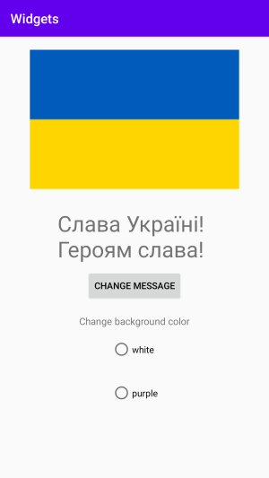
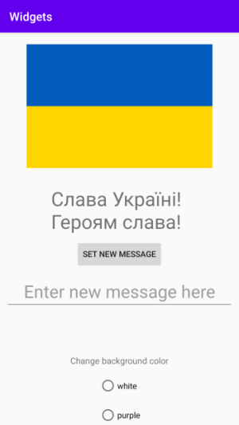
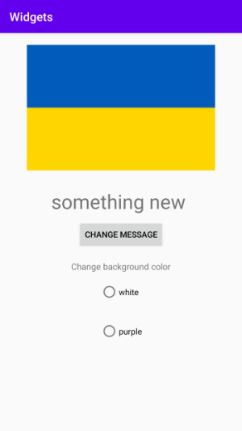
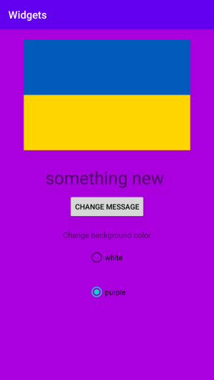
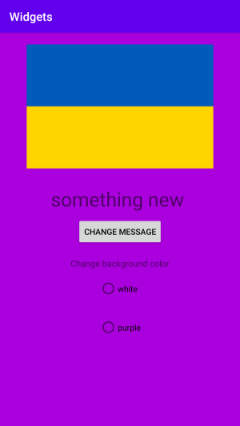

# Rapport

**Layouts and Views**

I denna uppgift skapades ett program som visar en Ukrainsk flagga och ett motto, samt ger möjligheten att byta motto och bakgrundsfärg. 



Att visa upp flaggan och mottot åstadkoms med hjälp av en ImageView och en TextView. Dessa två definierades i activity_main.xml

```
<ImageView
        android:id="@+id/flag"
        android:layout_width="wrap_content"
        android:layout_height="wrap_content"
        android:layout_margin="20dp"
        android:contentDescription="@string/flagdescription"
        android:src="@drawable/flag" />

 <TextView
        android:id="@+id/textview1"
        android:layout_width="wrap_content"
        android:layout_height="wrap_content"
        android:layout_margin="10dp"
        android:text="@string/greeting"
        android:textSize="15pt"
        app:layout_constraintBottom_toBottomOf="parent"
        app:layout_constraintLeft_toLeftOf="parent"
        app:layout_constraintRight_toRightOf="parent"
        app:layout_constraintTop_toTopOf="parent" />
```

Jag använde mig av attributet layout_margin="..." för att de inte skulle hamna för nära varandra. De båda instantierades sedan i koden med hjälp av findViewById(). Placeringen av samtliga views ändrades genom användandet av attributet android:gravity="center_horizontal" i definitionen av layouten. 

För att kunna ändra mottot så användes en knapp som frambringade ett redigeringsfält i form av ett EditText-objekt, där man kunde skriva in ett meddelande som ersatte det gamla. Knappen och redigeringsfältet definierades i activity_main.xml och instantierades med findViewById(). 

```
<EditText
        android:id="@+id/edittext"
        android:layout_width="match_parent"
        android:layout_height="wrap_content"
        android:layout_margin="10dp"
        android:ems="30"
        android:enabled="true"
        android:gravity="center_horizontal"
        android:hint="Enter new message here"
        android:imeOptions="actionDone"
        android:inputType="text"
        android:textSize="30sp"
        android:visibility="gone"/>

    <Button
        android:id="@+id/textbutton"
        android:layout_height="wrap_content"
        android:layout_width="wrap_content"
        android:text="Change message"
        android:layout_marginBottom="20sp"
        android:textColor="@color/statelist"/> 
```

Innan knappen tryckts in så skulle redigeringsfältet inte vara synligt, detta försäkrades genom att använda attributet android:visibility="ignore" vilket gör det osynligt och att det ej tar upp någon plats innan synligheten ändras. 

När knappen trycktes in så ändrades synligheten för redigeringfältet och en knapp för att bekräfta det ny meddelandet uppenbarades också. Då man skrivit ett nytt meddelande i fältet och tryckt på "SET NEW MESSAGE" så ändrades mottot, redigeringsfältet försvann och "CHANGE MESSAGE"-knappen återkom.  

       
-----------------------
    

Ovanstående åstadkoms genom att definiera en händelsehanterare för "CHANGE MESSAGE"-knappen. 

```
textEditButton.setOnClickListener(new View.OnClickListener() {
            public void onClick(View v) {
                Log.i("editbutton", "button was clicked");
                textEditView.setVisibility(View.VISIBLE);
                confirmTextButton.setVisibility(View.VISIBLE);
                textEditButton.setVisibility(View.INVISIBLE);
            }
        });  
```

Här definieras en hanterare för klickhändelser som gör redigeringsfältet och knappen för att bekräfta det ny meddelandet synligt, samt gör nämnda knapp osynlig. 

Nedanstående är klickhanteraren för att bekräfta det nya meddelandet. Denna kontrollerar om något skrivits och uppdaterar i så fall meddelandet med setText(), samt återställer den ursprungliga synligheten för knappar och redigeringsfältet  

```
 confirmTextButton.setOnClickListener(new View.OnClickListener() {
            @Override
            public void onClick(View v) {
                String newMessage = textEditView.getText().toString();
                Log.i("confirmTextButton_value", newMessage);
                if(!newMessage.isEmpty()){
                    tw.setText(textEditView.getText());
                }

                textEditView.setVisibility(View.GONE);
                confirmTextButton.setVisibility(View.GONE);
                textEditButton.setVisibility(View.VISIBLE);
            }
        });
```
 
För att ändra bakgrunden användes en RadioGroup med två RadioButtons vilka definierades i activity_main.xml. Radioknapparna samlades i en RadioGroup för att endast en av dem skulle kunna vara ifylld samtidigt. En hanterare definierades för radiogruppen som anropades varje gång den knapp som var ifylld byttes. 

```
bgColors.setOnCheckedChangeListener(new RadioGroup.OnCheckedChangeListener() {
            public void onCheckedChanged(RadioGroup arg0, int id) {
                switch (id) {
                    case R.id.white:
                        root.setBackgroundColor(getResources().getColor(R.color.colorWhite));
                        Log.i("@string/TAG", "Chose white");
                        break;

                    case R.id.purple:
                        root.setBackgroundColor(getResources().getColor(R.color.colorPurple));
                        Log.i("@string/TAG", "Chose purple");
                        break;
                    default:
                        Log.i("@string/TAG", "Huh?");
                        break;
                }
            }
        });
```  


För att kunna byta bakgrundsfärg förseddes den LinearLayout som användes för att organisera alla dessa views med ett id, variabeln root blev referens till denna då den instantierades med findViewById. Bakgrundsfärgen kunde därmed byta med ett anrop till root.setBackGroundColor().
 



Vanligtvis kan man ta bort fokus från samtliga radioknappar efter att en av dem fått fokus. Så även här. Detta åstadkoms genom att definiera en klickhanterare för layouten. 
Denna registrerades i activity_main.xml genom att använda attributet android:onClick

```
<LinearLayout xmlns:android="http://schemas.android.com/apk/res/android"
	...
    android:id="@+id/root"
    ...
    android:onClick="onClickLayout"
    tools:context=".MainActivity">
```

De andra klickhanterarna registrerades med ett metodanrop av typen  objekt.setOnClickListener(anonymous class) och definierades sedan i en anonym klass, varför alla dessa registreringar skedde i metoden onCreate().  
Men eftersom onClickLayout() registrerades i activity_main.xml så definierades metoden utanför onCreate() som en medlemsmetod i MainActivity. Definitonen såg ut som följer

```
public void onClickLayout(View v) {

        bgColors.clearCheck();

    }
```


Den hade effekten att om någon knapp i radiogruppen hade fokus så försvann detta så fort ett klick registrerades i någon del av layouten.  



